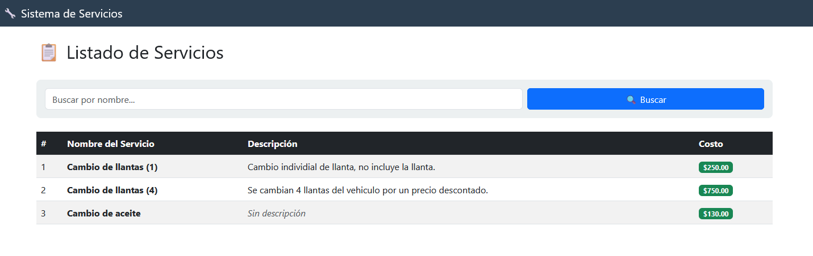
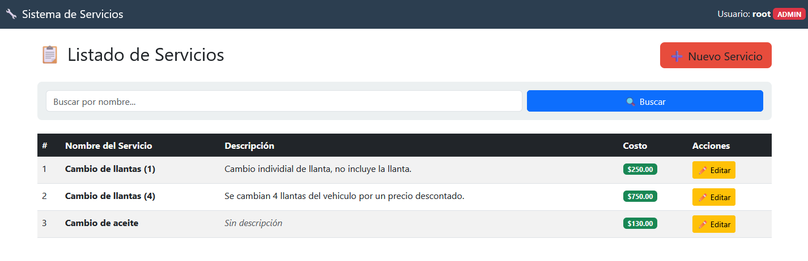
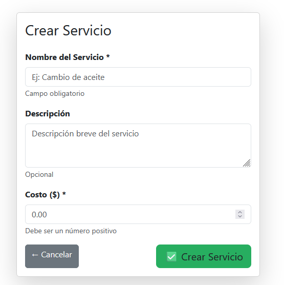
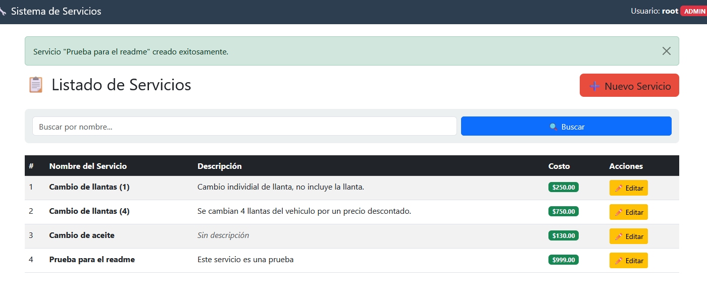
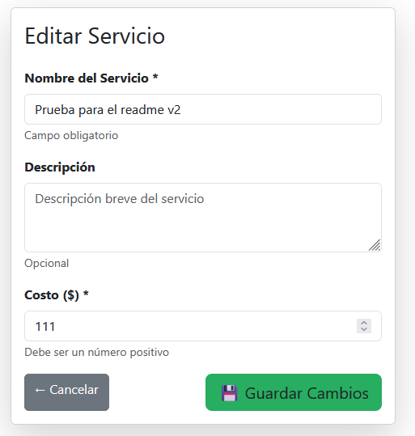
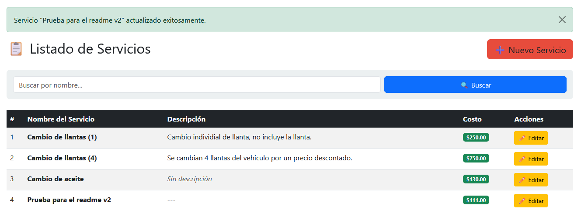

# ATLAS Taller API

API REST desarrollada con **Django + Django REST Framework**, contenedorizada con **Docker** y documentada con **Swagger (drf-spectacular)**.  

# Proyecto en Equipo  
## Materia: Tecnologías de Desarrollo en el Servidor  

### Objetivo  
Nuestro proyecto busca **agilizar el trabajo administrativo de un taller automotriz**, permitiéndoles llevar un **registro digital de sus operaciones, proveedores, clientes, servicios, etc.**  
Además, el sistema **automatiza la comunicación con los usuarios mediante el envío de correos electrónicos**, optimizando así la gestión interna del taller.

---

### Ejecución del Proyecto  

1. Clonar o descargar el repositorio.  
2. Abrir una terminal en la carpeta del proyecto.  
3. Ejecutar el siguiente comando para construir y levantar los contenedores:
```sh
   docker compose up --build
```

   
Esto levantará:
   - Web (Django) en http://localhost:8500
   - Base de datos (PostgreSQL) en el puerto 5432
   
## Aplicar migraciones
```sh
   docker compose exec web python manage.py makemigrations
   docker compose exec web python manage.py migrate
```

## Superuser:
```sh
   docker compose exec web python manage.py createsuperuser
```

Accede luego al panel:
   - http://localhost:8500/admin/

Endpoints principales
Recurso	            Método	                           Descripción
/api/clients/	      GET / POST / PUT / DELETE	         Gestión de clientes
/api/cars/	         GET / POST / PUT / DELETE	         Gestión de autos
/api/services/	      GET / POST / PUT / DELETE	         Servicios del taller
/api/orders/	      GET / POST / PUT / DELETE	         Órdenes de servicio
/api/invoices/	      GET / POST / PUT / DELETE	         Facturas de clientes

## Documentación Swagger
- UI: http://localhost:8500/api/docs/
- ReDoc: http://localhost:8500/api/redoc/
- Schema JSON: http://localhost:8500/api/schema/


## Historias de Usuario (Servicios - Luis Pelayo) 

### 1 - Lista de servicios existente
Dirigirse a /servicios para visualizar los servicios existentes.




### 2 - Crear servicios
Como superusuario, en /servicios aparecera un boton para crear servicios, con un formulario que solicita nombre, descripcion y costo de servicio. Tambien se puede acceder directamente desde /servicios/crear






### 3 - Editar servicios
Como superusuario, en /servicios, en cada tarjeta de servicio aparecera un boton para editar, que redirige a un formulario identico al de creacion de servicio. Tambien se pueden editar mediante /servicios/:id/editar




